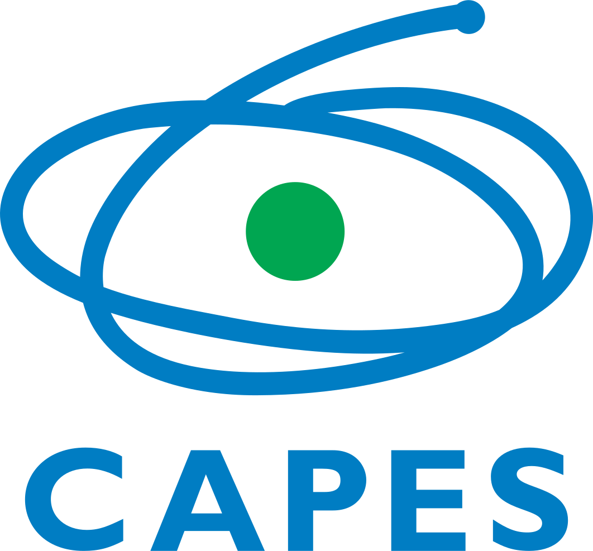

# mastersthesis

<!-- quarto render --profile gfm -->

<!-- badges: start -->
[](https://www.repostatus.org/#active)
[](https://doi.org/10.17605/OSF.IO/YGKTS)
[](https://opensource.org/license/mit)
[](https://creativecommons.org/licenses/by/4.0/)
<!-- badges: end -->

## Overview

☀️🌙⏰🛌💤🌍🗺️🧭📅🧬🧠🕰️📊📓

This repository contains the [Quarto
book](https://quarto.org/docs/books/) of my Master’s Thesis: *Is
Latitude Associated with Chronotype?* The research compendium is
accessible via [The Open Science Framework](https://osf.io/) by clicking
[here](https://doi.org/10.17605/OSF.IO/YGKTS).

The assemble of this repository was inspired by Ben Marwick, Carl
Boettiger & Lincoln Mullen’s article [Packaging Data Analytical Work
Reproducibly Using R (and
Friends)](https://doi.org/10.1080/00031305.2017.1375986).

## How to Use

All analyses in this thesis are fully reproducible and were conducted
using the [R programming language](https://www.r-project.org/) alongside
the [Quarto](https://quarto.org/) publishing system. The
[`renv`](https://rstudio.github.io/renv/) package was used to ensure
that the R environment used can be restored (see `renv.lock`). All the
computational notebooks can be found in the `qmd` directory.

It’s important to note that some restrictions apply to the availability
of the main research data, which contain personal and sensitive
information. As a result, this data cannot be publicly shared. To run
the analyses, users must have an internet connection and request a set
of access keys from the author (see *Keys* section).

If you don’t feel comfortable with R, I strongly recommend checking
Hadley Wickham and Garrett Grolemund’s free and online book [R for Data
Science](https://r4ds.hadley.nz/) and the Coursera course from John
Hopkins University [Data Science: Foundations using
R](https://www.coursera.org/specializations/data-science-foundations-r).

To reproduce the analyses do the following steps:

1)  Make sure that you have the latest R version and the following R
    packages installed in your machine:

``` r
install.packages(
  c("cli", "here" ,"magrittr", "ragg", "renv", "stats", "stringr")
)
```

2)  Clone this repository.
3)  Open the R project in your IDE of choice.
4)  Run
    [`renv::restore()`](https://rstudio.github.io/renv//reference/restore.html)
    to install all software dependencies.
5)  Set all the keys provided by the author in the `.Renviron` file and
    the `_ssh` folder.
6)  Execute `targets::tar_make()` to run the entire pipeline, processing
    the raw data through to the validated and weighted data.
7)  Run any analysis present in the computational notebooks (`qmd`
    directory).

## Keys

To access the data and run the notebooks, you will need to set the
following keys in a file named
[`.Renviron`](https://bookdown.org/csgillespie/efficientR/set-up.html#:~:text=2.4.6%20The%20.Renviron%20file)
located in the root directory of the project:

- `OSF_PAT`: Your [OSF](https://osf.io/) Personal Access Token (PAT). If
  you don’t have one, go to the settings section of your OSF account and
  create a new token.
- `MASTERSTHESIS_PASSWORD`: The password for the project’s RSA private
  key (32 bytes).

Additionally, you will need the following keys in the project’s `_ssh`
folder:

- `id_rsa`: The project’s private RSA key (RSA 4096 bits (OpenSSL)).
- `id_rsa.pub`: The project’s public RSA key.

These project’s keys will be provided by the author of the thesis upon
reasonable request. As reasonable requests, I consider those made by
researchers with a legitimate interest in the thesis topic, whose
projects are of high quality, ethically conducted, and who have obtained
all necessary approvals for their research proposal.

## License

[](https://opensource.org/license/mit)
[](https://creativecommons.org/licenses/by/4.0/)

The code accompanying this thesis is distributed under the [MIT
License](https://opensource.org/license/mit). All documents are released
under the [Creative Commons Attribution 4.0 International Public
License](https://creativecommons.org/licenses/by/4.0/).

The research data is subject to a private license and is not publicly
available due to privacy and ethical considerations.

## How to Cite

To cite this work, please use the following format:

Vartanian, D. (2024). *Is latitude associated with chronotype?*
\[Master’s Thesis, University of São Paulo\].
<https://doi.org/10.17605/OSF.IO/YGKTS>

A BibTeX entry for LaTeX users is:

    @mastersthesis{vartanian2024,
      title = {Is latitude associated with chronotype?},
      author = {Daniel Vartanian},
      year = {2024},
      address = {São Paulo},
      school  = {University of São Paulo},
      langid = {en},
      url = {https://doi.org/10.17605/OSF.IO/YGKTS},
      note = {Corrected version}
    }

## Acknowledgments

<table>
  <tr>
    <td width="30%">
      <br/>
      <br/>
      <p align="center">
        <a href="https://www.prpg.usp.br/pt-br/faca-pos-na-usp/programas-de-pos-graduacao/621-modelagem-de-sistemas-complexos">
          
        </a>
      </p>
      <br/>
    </td>
    <td width="70%">
      <p>
        This thesis was developed in the Graduate Program in Modeling 
        Complex Systems (<a href="https://www.prpg.usp.br/pt-br/faca-pos-na-usp/programas-de-pos-graduacao/621-modelagem-de-sistemas-complexos">PPGSCX</a>) at the University of São Paulo (<a href="https://www5.usp.br/">USP</a>) under the supervision of
        <a href="https://orcid.org/0000-0001-6783-6695">Prof. Dr. Camilo Rodrigues Neto</a>.
      </p>
    </td>
  </tr>
</table>

<table>
  <tr>
    <td width="30%">
      <br/>
      <p align="center">
        <a href="https://www.gov.br/capes/">
          
        </a>
      </p>
      <br/>
    </td>
    <td width="70%">
      <p>
        This study was financed by the Coordenação de Aperfeiçoamento de 
        Pessoal de Nível Superior - Brazil (<a href="https://orcid.org/0000-0001-6783-6695">CAPES</a>) - Finance Code 001, Grant Number 88887.703720/2022-00.
      </p>
    </td>
  </tr>
</table>
